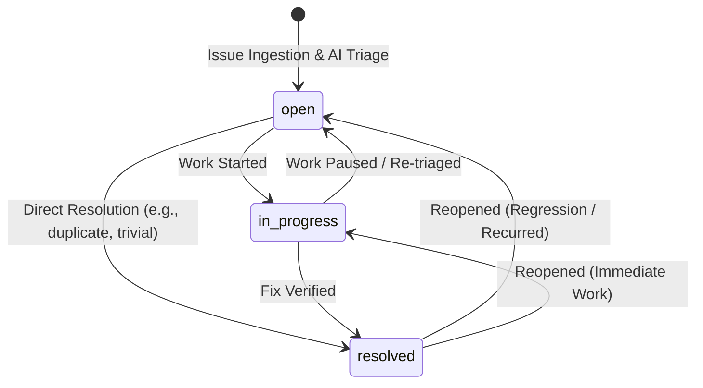

# Product Specification: Issue Lifecycle & State Transitions

This document defines the lifecycle states, state machine rules, transition conditions, and API contracts for issues tracked in SmartFlow.

---

## 1. Overview

Every issue submitted to SmartFlow moves through a clearly defined lifecycle. This lifecycle ensures full visibility into issue status—from automated AI triage to engineer assignment and final resolution.

---

## 2. Issue Status Definitions

SmartFlow defines three core lifecycle statuses:

| Status | Display Label | Description | Criteria for Entry |
| :--- | :--- | :--- | :--- |
| `open` | **Open** | The issue has been ingested and triaged by AI, but work has not yet started. | Default state upon issue creation. Reopened from resolved if regression occurs. |
| `in_progress` | **In Progress** | An engineer or team member is actively investigating, fixing, or testing a solution. | An assignee begins work or moves the issue onto an active board. |
| `resolved` | **Resolved** | The solution has been implemented, verified, or the inquiry has been answered. | Fix deployed and verified, or marked as duplicate/not reproducible. |

---

## 3. State Transition Matrix & Diagram

### State Machine Diagram



### Transition Matrix

| From State | To State | Permitted? | Trigger / Context |
| :--- | :--- | :---: | :--- |
| `open` | `in_progress` | ✅ Yes | Engineer begins investigation or development. |
| `open` | `resolved` | ✅ Yes | Quick resolution without prolonged investigation (e.g., duplicate issue). |
| `in_progress` | `resolved` | ✅ Yes | Code fix merged, deployed, and verified. |
| `in_progress` | `open` | ✅ Yes | Work deprioritized, unassigned, or blocked. |
| `resolved` | `open` | ✅ Yes | Issue reopened due to recurrence or regression. |
| `resolved` | `in_progress` | ✅ Yes | Reopened with immediate investigation underway. |
| `*` | `*` (same state)| ⚠️ No-op | Request returns `200 OK` with unchanged record. |

---

## 4. API Contract Alignment

Status modifications are handled via the dedicated endpoint defined in [openapi.yaml](./openapi.yaml):

### Endpoint: `PATCH /api/issues/{id}/status`

#### Request Payload
```json
{
  "status": "in_progress"
}
```

#### Validation Rules
1. **Allowed Values**: Must be strictly one of `["open", "in_progress", "resolved"]`.
2. **Entity Existence**: The issue ID must exist in SQLite; otherwise, return `404 Not Found`.
3. **Audit Timestamp**: The `updatedAt` field must automatically be updated to the current ISO-8601 UTC timestamp (`new Date().toISOString()`).

#### Response (`200 OK`)
```json
{
  "success": true,
  "data": {
    "id": "3fa85f64-5717-4562-b3fc-2c963f66afa6",
    "title": "Production checkout fails on credit card submission",
    "status": "in_progress",
    "category": "BUG",
    "urgency": "CRITICAL",
    "updatedAt": "2026-09-15T10:45:00.000Z"
  }
}
```

#### Error Responses
- `400 Bad Request`: Payload contains an unsupported status value.
  ```json
  {
    "success": false,
    "error": {
      "code": "INVALID_STATUS_VALUE",
      "message": "Status must be one of: open, in_progress, resolved.",
      "statusCode": 400
    }
  }
  ```
- `404 Not Found`: Issue with the provided UUID does not exist.

---

## 5. UI Representation Standards

- **Color Coding**:
  - `open`: Amber / Yellow badge (`bg-amber-100 text-amber-800 border-amber-300`)
  - `in_progress`: Blue badge (`bg-blue-100 text-blue-800 border-blue-300`)
  - `resolved`: Green badge (`bg-emerald-100 text-emerald-800 border-emerald-300`)
- **Optimistic Updates**: The frontend dashboard updates the status badge immediately upon selection in the dropdown and rolls back if the API request fails.
